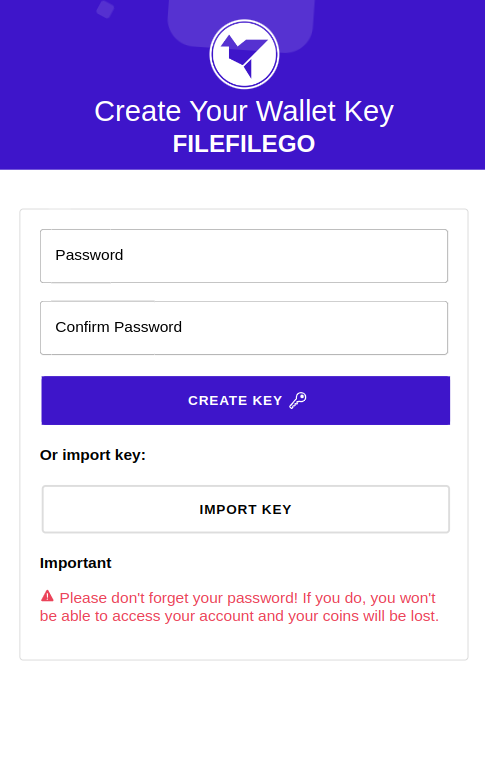

# FileFileGo Mobile Wallet for Android and iOS



The application uses ionic and capacitor to perform native operations. The cryptographics and encryption functions and algorithms are compatible with the browser and don't depend on node.

```
// install ionic
npm i -g @ionic/cli

// install dependencies
npm install

// build the application
ionic build

// to run in a browser
ionic serve

// add android project
ionic capacitor add android

// sync the built assets with the android / ios project
npx cap sync

// build the android project
// open android studio and run
ionic capacitor build android

```

## Get it on Android

[](https://play.google.com/store/apps/details?id=com.filefilego.wallet)